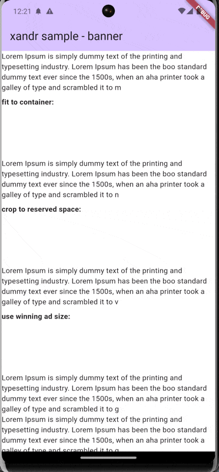
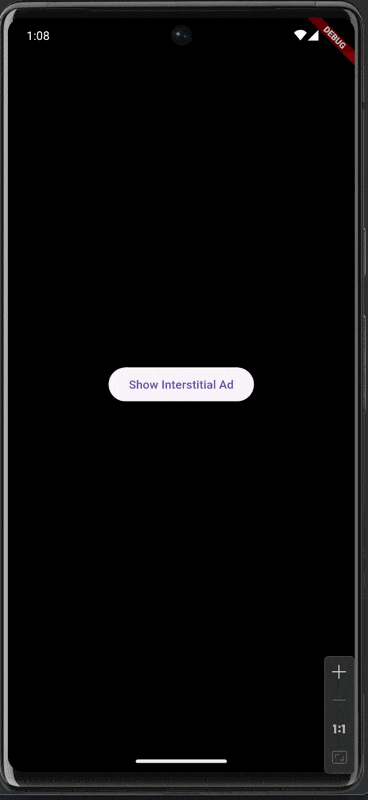

# xandr

 

This is the flutter integration for xandr.

**Please Note: This is a work in progress and the api is likely to change.**

## Contributing to the project

Please the [CONTRIBUTING.md](CONTRIBUTING.md) for details.

## example usage:

**The flutter api is work in progress and will likely change.**

However there are three main concepts:
- there is a central `XandrController()` which:
  - when called with `XandrController().init(memberId)` will initialize the sdk
  - takes care of loading ads
  - propagates ad events to the flutter side
- there is a `XandrBuilder()` widget which:
  - simplifies handling of the global `XandrController()`
  - makes sure that all child-ads are only requested once the sdk is successfully initialized
- there is an `AdBanner()` widget which:
  - can request banners by size options, `placementId` and/or `inventoryCode`
  - `customKeywords` are also supported
  - behind the scenes the widget size is adjusted accordingly
  - is shown by default when created (can be adjusted through `loadMode`)
  - can be set to refresh every X seconds (regardless whether it's in the viewport or not)
  - provides a `onBannerFinishLoading` callback when loading is done
  - can provide native ads
- there is an `InterstitialAd()` which:
  - can request an interstitial by `placementId` and/or `inventoryCode`
  - `customKeywords` are also supported
  - after the ad is loaded, it can be shown by calling `show()`

## AdBanner
Used to display a simple advertisement banner.
|name|mandatory|description|example|
|--|--|--|--|
|controller|yes|`XandrController` instance|-|
|adSizes|yes|list of `AdSize` to request the banner|[AdSize(300, 250), AdSize(1, 1)]
|placementID|yes if inventoryCode not filled|Xandr banner placement ID|-|
|inventoryCode|yes if placementID not filled|Xandr banner inventory code|-|
|width|no|`double` of the initial ad width|null|
|height|no|`double` of the initial ad height|null|
|onBannerFinishLoading|no|`Function` callback which is called when the banner finished loading, with the following params: `success` (bool, whether the ad was loaded successfully), `width` (nullable double, if ad was loaded provides its width), `height` (nullable double, if the ad was loaded provides its height), `nativeAd` (nullable `NativeAdData`, if the ad was loaded and is a native ad this provides its data such as title, description, ...)|`onBannerFinishLoading: ({                    required success,                    height,                    width,                    nativeAd,                  }) =>                      print('on banner finish loading: success: $success')`|
|customKeywords|no|list of keywords to request the Xandr banner|{'kw': ['test-kw', 'demoads'] }
|autoRefreshInterval|no|`Duration` of each banner auto refresh (can be set to `Duration.zero` to prevent auto refresh)|Duration(seconds: 30)|
|allowNativeDemand|no|`bool` whether to allow requesting native ads or not - If set to true you must also include `AdSize(1, 1)` in the adSizes|false|
|nativeAdRendererId|no|`Int` of the native ad renderer ID to use when requesting native ads, requires `allowNativeDemand = true` to be set|1|
|nativeAdBuilder|no|widget rendering function to render a native ad - provides a `NativeAdData` which contains: `title`, `description`, `imageUrl`, `clickUrl` of the native ad|`nativeAdBuilder: (nativeAd) => Text(nativeAd.title)`
|clickThroughAction|no|`ClickThroughAction` to handle ad behavior when clicked|`ClickThroughAction.returnUrl` (does not handle ad click, needs to be handled by developer on `onAdClicked` callback), `ClickThroughAction.openSdkBrowser` (opens an internal app browser through the SDK), `ClickThroughAction.openDeviceBrowser` (opens the ad externally through the device browser)|
|onAdClicked|no|`Function` callback called when the ad is clicked and clickThroughAction is `ClickThroughAction.returnUrl`|`onAdClicked: (url) =>  print('click url: $url')`|
|loadMode|no|`LoadMode` to handle ad creation logic|`LoadModeWhenCreated` to start loading the ad as soon as it's created, `LoadMode.whenInViewport` to only start loading the ad when in viewport|
|multiAdRequestController|no|`MultiAdRequestController` if this placement should be included in a multi ad request||
|shouldServePSAs|no|`bool` determines whether PSAs (Public Service Announcements) should be served. PSAs (Public Service Announcements) are ads that can be served as a last resort, if there are no other ads to show.|false|

### sample code:

For a running examples please check the sample app at [example/lib/main.dart](packages/xandr/example/lib/main.dart) - the sample app can be run using `melos run run:example -- -d sdk` (android) or `melos run run:example -- -d IPhone` (iOS).

In order to initialize the xandr sdk, and show a banner ad run:

```dart
_controller = XandrController();
...
XandrBuilder(
    controller: _controller,
    memberId: 9517,
    builder: (context, snapshot) {
        if (snapshot.hasData) {
            debugPrint('Xandr SDK initialized, success=${snapshot.hasData}');
            return AdBanner(
                controller: _controller,
                inventoryCode: 'bunte_webdesktop_home_homepage_hor_1',
                adSizes: const [AdSize(728, 90),],
                customKeywords: useDemoAds,
            );
        } else if (snapshot.hasError) {
            return const Text('Error initializing Xandr SDK');
        } else {
            return const Text('Initializing Xandr SDK...');
        }
    },
)
```

**Result:**

 

Also, results of the `AdResponse` are propagated to the flutter side:

```
...
I/flutter (16949): xandr.onAdLoaded: 0, size=728x90, creativeId=158504583, adType=BANNER, tagId=20835075, auctionId=6349340599071400911, cpm=0.10855, memberId=9517
...
```

Loading an interstitial ad is similar, however its a two step process:

  1. loading the ad

```dart
...
_interstitialAd = InterstitialAd(
  controller: _controller,
  inventoryCode: 'bunte_webphone_news_gallery_oop_0',
);
...
```

  2. showing the ad with optional auto-hide after a given amount of time

```dart
XandrInterstitialBuilder(
  interstitialAd: _interstitialAd,
  builder: (context, snapshot) {
    if (snapshot.hasData) {
      debugPrint('Xandr interstitial ad loaded, '
          'success=${snapshot.hasData}');
      return Column(
        mainAxisAlignment: MainAxisAlignment.center,
        children: [
          ElevatedButton(
            onPressed: () async {
              debugPrint('show interstitial ad...');
              final result =
                  await _interstitialAd.show(autoDismissDelay: 10);
              debugPrint(
                'interstitial ad has been closed result=$result',
              );
            },
            child: const Text('Show Interstitial Ad'),
          ),
        ],
      );
    } else if (snapshot.hasError) {
      return const Text('Error loading Xandr interstitial ad');
    } else {
      return const Text('Loading Xandr interstitial ad...');
    }
  },
)
```

***Result:***



To run the interstitial example app, run `melos run run:example:interstitial -- -d sdk` (android only atm).

Banner Ads can also be loaded using a multi ad request: ads are just initialized, and loaded with the single request to the adserver:

  1. create a multi ad controller and use a future builder to get the multi ad request initialized - this requires an already initialized xandr controller as well

```dart
...
_multiAdRequestController = MultiAdRequestController();
...
FutureBuilder<bool>(
  future: _multiAdRequestController.init(),
  builder: (_, multiAdRequestSnapshot) {
    if (multiAdRequestSnapshot.hasData) {
      debugPrint(
        'MultiAdRequestController initialized, '
        'success=${multiAdRequestSnapshot.data}',
      );

      return SingleChildScrollView(
        controller: _scrollController,
        child: Column(
          children: [
            TextButton(
              onPressed: () {
                _multiAdRequestController.loadAds();
              },
              child: const Text('load ads'),
            ),
            AdBanner(
              controller: _controller,
              //placementID: '17058950',
              inventoryCode:
                  'bunte_webdesktop_home_homepage_hor_1',
              adSizes: const [
                AdSize(728, 90),
              ], //[AdSize(300, 250)],
              customKeywords: useDemoAds,
              resizeAdToFitContainer: true,
              multiAdRequestController: _multiAdRequestController,
            ),
            AdBanner(
              controller: _controller,
              //placementID: '17058950',
              inventoryCode:
                  'bunte_webdesktop_home_homepage_hor_1',
              adSizes: const [
                AdSize(728, 90),
              ], //[AdSize(300, 250)],
              customKeywords: useDemoAds,
              resizeAdToFitContainer: true,
              multiAdRequestController: _multiAdRequestController,
            ),
          ],
        ),
      );
    } else if (multiAdRequestSnapshot.hasError) {
      debugPrint(
        'Error initializing MultiAdRequestController: '
        '${multiAdRequestSnapshot.error}',
      );
      return const Text('Error initializing multi ad request');
    } else {
      debugPrint('Initializing MultiAdRequestController...');
      return const Text('Initializing multi ad request...');
    }
  },
)
```

clicking on the `load ads` button will load the ads in a single request.

***Result:***


To run the multi ad request example app, run `melos run run:example:multiadrequest -- -d sdk` (android only atm).
